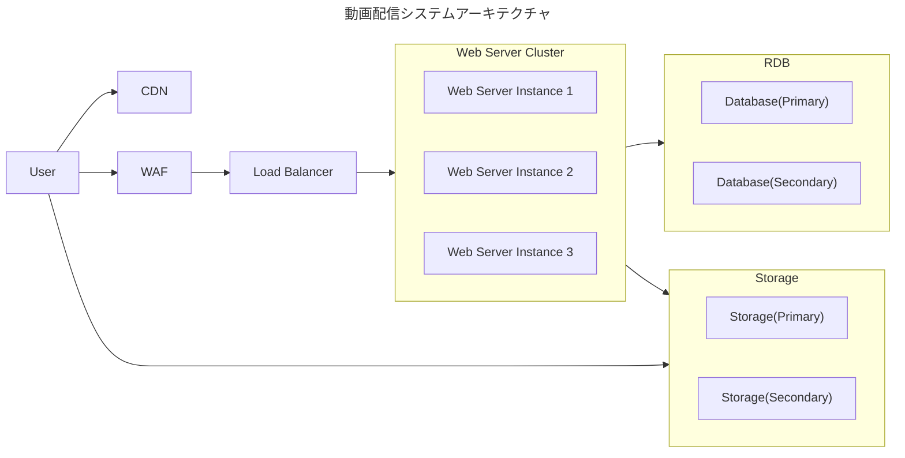
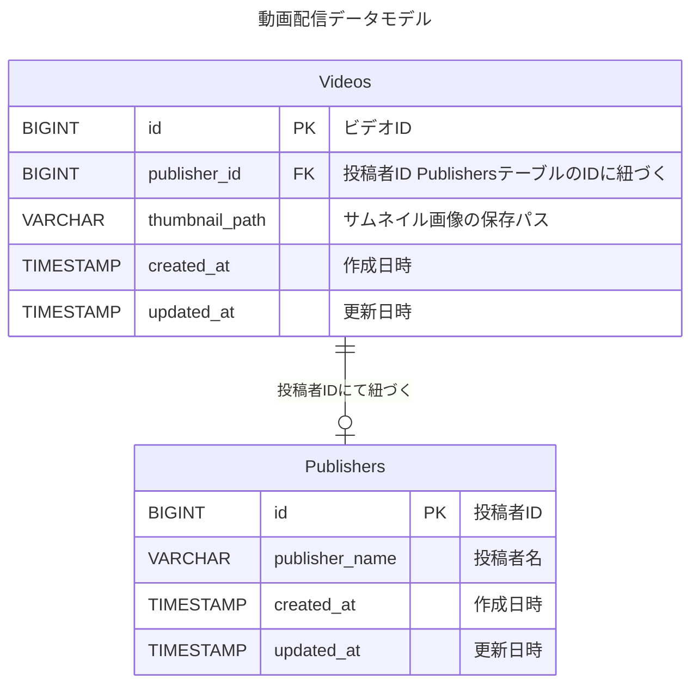

# テスト 3, 4

# 動画配信プラットフォーム　システム設計

# テスト 3

- `/home`にアクセスがある
- リクエスト数が多いため、サーバーの負荷を分散させる必要がある
- 動画の投稿者名, 動画サムネイル, 動画の視聴 URL を返す

## アーキテクチャ図

## アーキテクチャフロー

1. ユーザーが`/home`にアクセスし、WAF に到着
1. WAF にて悪意のあるアクセスか判断し、問題がなければ リクエストを Load Balancer に送る
   悪意がある場合は、リクエストを拒否する
1. Load Balancer がリクエストを適切な Web Server Instance に振り分ける
1. Web Server が データベースからデータを取得し、投稿者名、サムネイル画像、視聴 URL を含む HTML ファイルを生成して返す
   (今回は HTML ファイルを返す設計にする)
1. HTML ファイルに記載されているサムネイル画像が CDN にキャッシュされている場合は、CDN が画像を返す
   - キャッシュされていない場合は、直接 Storage にアクセスして、画像データを取得する

- 多くのリクエストを処理するため

  - 負荷分散を Web サーバーの前に配置し、負荷を分散させる
  - アクセス数に応じて Web サーバーインスタンスを自動で増減させる
  - サムネイル画像は Storage に保存する
    - サムネイル画像の高速表示とストレージアクセスの最小化のため、CDN を使用する
    - CDN のキャッシュがない場合はストレージから取得、サムネイル画像の更新時には URL を変更してキャッシュを無効化する

- セキュリティ対策として WAF を導入し、悪意のある攻撃（DoS 攻撃など）を防止する
- データベースとストレージは冗長化し、Primary と Secondary を用意する

## データモデル

### Videos テーブル

- id カラム
  - Primary Key として設定する
  - id カラムを元にプロダクトコード側で動画視聴 URL を生成する`ex. https://example.com/v?id={id}`
- thumbnail_path カラム
  - サムネイル画像が保存されているストレージのパスを格納
  - thumbnail_path カラムを元にサムネイル画像の URL をプロダクトコードで生成する`ex. https://storage.googleapis.com/example-bucket/{thumbnail_path}`
  - 格納するストレージを変更してもプロダクトコード側を修正することで、 DB のデータを更新せずに URL を生成することができる
- publisher_id カラム
  - Publishers テーブルの id を参照する外部キー制約

### Publishers テーブル

- id カラム
  - Primary Key として設定する
  - Videos テーブルの publisher_id と結合させてデータを取得する
- publisher_name カラム
  - 投稿者名を格納する

# テスト 4

- 同時アクセスを 100rps までしか受け付けられず「Too many open connections」となる
- 10000rps(従来の 100 倍)のリクエストを処理するにはどのようなアプローチを取るべきか

## 回答

- 現行システムの詳細な設計やログなどを調査し、原因を特定する

特定した原因を元に以下を対策を検討する

- インフラの最適化
  - Web サーバーの最大同時接続数を増やす
    RDB や Storage への接続も調整が必要
  - Web サーバーのインスタンス数を増やす
    一つのインスタンスが処理するリクエスト数が増加すると負荷が上がるため、複数台に負荷を分散する
  - Web サーバーのスペックを上げる
    処理するリクエスト数の増加により、CPU やメモリなどのリソースが不足する可能性があるため、処理能力を向上させる
  - DB の最適化
    CPU やメモリ使用率が上がると、処理が遅くなるためスペックを調整する
  - HTTP/2 で通信を行う
    並列処理により、少ない接続数で効率的にデータをやり取りし、通信速度を向上させる
- バックエンドの最適化
  - レスポンスを高速化するため、 HTTP サーバーをマルチスレッドで立ち上げ、並列でリクエストを処理する
  - データ量が増えた場合、DB から全件取得すると処理が重くなるため、ページネーションを使って分割で取得する(`/home`へのアクセスの場合)
